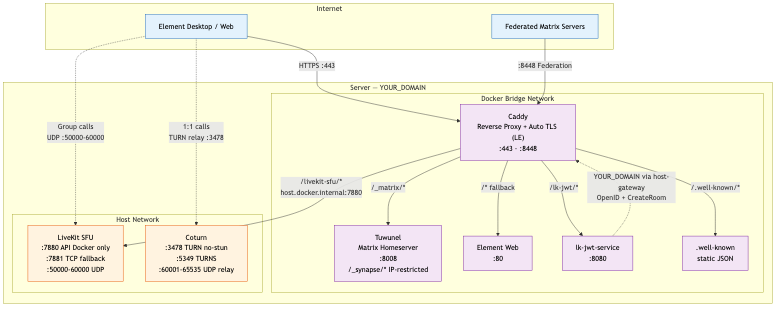
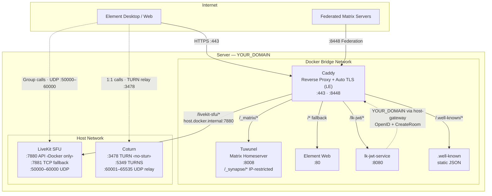

# Matrix Homeserver — Tuwunel + Caddy + LiveKit + Coturn

Production-ready Matrix chat and **group video** platform using Docker Compose
with Tuwunel (Rust-based Matrix homeserver), Caddy (reverse proxy with automatic
HTTPS), LiveKit (SFU for group video/voice via Element Call), and Coturn (TURN
relay for 1:1 WebRTC calls).

## Architecture

<picture>
  <source media="(prefers-color-scheme: dark)" srcset="Architecture-rendered.png">
  
</picture>

<details><summary>Mermaid source (click to expand)</summary>



</details>

### Request Routing

```
Client ─── HTTPS :443 ───► Caddy ─┬─ /_matrix/*         ──► Tuwunel :8008
                                  ├─ /_synapse/*        ──► Tuwunel :8008 (server IPs only)
                                  ├─ /lk-jwt/*          ──► lk-jwt-service :8080
                                  ├─ /livekit-sfu/*     ──► LiveKit :7880 (host)
                                  ├─ /.well-known/*     ──► static files
                                  └─ /*                 ──► Element Web :80

Fed    ─── HTTPS :8448 ──► Caddy ─── /_matrix/*         ──► Tuwunel :8008
```

### Call Flows

```
1:1 calls    Element ···  WebRTC P2P  ··· Coturn TURN/TURNS relay (:3478 / :5349)
Group calls  Element ──►  lk-jwt ──►  LiveKit SFU (:50000-60000 UDP)
```

### Key Connections

| From | To | Via | Purpose |
|------|----|----|---------|
| Client | Caddy :443 | HTTPS | All API, web UI, JWT, SFU signaling |
| Fed servers | Caddy :8448 | HTTPS | Matrix federation |
| Caddy | Tuwunel :8008 | Bridge | `/_matrix/*` `/_synapse/*` |
| Caddy | Element Web :80 | Bridge | `/*` (fallback) |
| Caddy | lk-jwt :8080 | Bridge | `/lk-jwt/*` |
| Caddy | LiveKit :7880 | host.docker.internal | `/livekit-sfu/*` |
| Caddy | .well-known files | File server | `/.well-known/*` |
| lk-jwt | Caddy | host-gateway → :443 | OpenID validation + CreateRoom |
| Client | LiveKit | Direct UDP | Group call media :50000-60000 |
| Client | Coturn | Direct UDP/TCP | 1:1 call TURN relay :3478 / TURNS :5349 |


### Key Security Measures

- **STUN disabled** (`no-stun` in coturn) — prevents UDP amplification attacks
- **TURNS (TLS)** on :5349 — encrypted TURN relay using Caddy's Let's Encrypt certs
- **`/_synapse/` admin API** restricted to server IPs only (127.0.0.1, ::1, server public IPs)
- **CORS** narrowed to `/_matrix/*` and `/.well-known/*` paths only
- **LiveKit API (7880)** only reachable from Docker bridge network (172.16.0.0/12)
- **Registration** requires a token (not open)
- **All secrets** file-mounted with 600 permissions
- **HTTPS-only** via Caddy auto-TLS (Let's Encrypt)
- **Docker log rotation** — `json-file` driver with size caps to prevent disk fill
- **Weekly coturn restart** cron for TLS cert renewal

## Prerequisites

- Linux server (Ubuntu 24.04 LTS recommended) with public IPv4 and IPv6 addresses
- Root or sudo access
- A domain name with DNS A and AAAA records pointing to your server
- Ports open to the internet: 80, 443, 8448, 3478, 5349, 50000-60000, 60001-65535
- At least 2 GB RAM and 10 GB disk space

### Pre-Deployment Checks

Run these checks before `setup.sh` or `ansible-playbook`:

```bash
# 1) DNS resolution should already match your server
dig +short YOUR_DOMAIN A
dig +short YOUR_DOMAIN AAAA

# 2) Required public ports must not be occupied by another service
sudo ss -lntup | grep -E ':(80|443|8448|3478|5349|7881)\b'

# 3) Server IP sanity
curl -4 ifconfig.me
curl -6 ifconfig.me
```

If you do not use IPv6, remove IPv6-specific values consistently in all config
files instead of leaving `YOUR_IPV6` placeholders.

## Configuration

All configuration uses placeholders that **must be customized** before deployment. Edit these files:

- `setup.sh` (the script also has `DOMAIN`, `SERVER_IP_V4`, `SERVER_IP_V6`, and `ADMIN_EMAIL` variables)
- `Caddyfile`, `docker-compose.yml`, `tuwunel.toml`, `coturn.conf`, `livekit.yaml`, `element-config.json`
- `ansible/inventory/hosts.yml` and `ansible/inventory/group_vars/matrix_servers.yml` (if using Ansible)

`config.env.example` is a reference template only. It is not auto-loaded by
`setup.sh` or `update.sh`.

### Option 1: Manual Setup (Root configs)

1. Edit all files and replace placeholders:

```bash
# Replace YOUR_DOMAIN, YOUR_IPV4, YOUR_IPV6, YOUR_EMAIL throughout:
find . -type f \( -name "*.yml" -o -name "*.conf" -o -name "*.toml" -o -name "Caddyfile" -o -name "*config.json" \) \
  -exec sed -i 's/YOUR_DOMAIN/example.com/g' {} \;
sed -i 's/YOUR_IPV4/1.2.3.4/g' $(find . -type f)
sed -i 's/YOUR_IPV6/2001:db8::1/g' $(find . -type f)
sed -i 's/YOUR_EMAIL/admin@example.com/g' $(find . -type f)
```

2. Deploy:

```bash
sudo ./setup.sh
```

3. Verify deployment with the checks in the Health Checks section below.

### Option 2: Ansible (Recommended for updates)

1. Edit Ansible variables:

```bash
# ansible/inventory/hosts.yml — set your server host, IP, SSH user
# ansible/inventory/group_vars/matrix_servers.yml — set domain, IPs, email
```

2. Deploy:

```bash
cd ansible
ansible-playbook site.yml
```

3. Common rerun patterns:

```bash
# Re-render templates only (requires secrets facts to be available in the run)
ansible-playbook site.yml --tags secrets,config

# Restart and health checks only
ansible-playbook site.yml --tags deploy
```

### What Ansible Automates

- Installs dependencies and Docker
- Generates and preserves Matrix/LIVEKIT/TURN secrets
- Renders all major config files from templates
- Applies UFW firewall rules
- Deploys and health-checks Docker services
- Installs weekly coturn restart cron for TLS certificate refresh

Still manual:
- DNS setup (A/AAAA and optional federation SRV)
- External Keycloak realm/client provisioning (if enabled)

## Quick Start

```bash
# 1. Copy files to the server
scp -r ./* user@your-server:/tmp/matrix-deploy/

# 2. SSH in and prepare
ssh user@your-server
sudo mkdir -p /opt/matrix
sudo cp -r /tmp/matrix-deploy/* /opt/matrix/
cd /opt/matrix

# 3. Parameterize (replace YOUR_* placeholders)
sudo sed -i 's/YOUR_DOMAIN/example.com/g' ./* ./ansible/inventory/*.yml
sudo sed -i 's/YOUR_IPV4/1.2.3.4/g' ./* ./ansible/inventory/*.yml

# 4. Make scripts executable
sudo chmod +x setup.sh firewall.sh update.sh verify-config.sh

# 5. Deploy
sudo ./setup.sh
```

## Services

| Service | Image | Network | Purpose |
|---------|-------|---------|---------|
| **Tuwunel** | `ghcr.io/matrix-construct/tuwunel:latest` | Bridge | Matrix homeserver (Rust) |
| **Caddy** | `caddy:latest` | Bridge | Reverse proxy, auto-TLS |
| **Element Web** | `vectorim/element-web:latest` | Bridge | Matrix web client |
| **lk-jwt-service** | `ghcr.io/element-hq/lk-jwt-service:latest` | Bridge | Matrix auth → LiveKit JWT |
| **LiveKit** | `livekit/livekit-server:latest` | Host | SFU for group video/voice |
| **Coturn** | `coturn/coturn:latest` | Host | TURN relay for 1:1 calls |

## Ports

| Port | Protocol | Access | Service |
|------|----------|--------|---------|
| 80 | TCP | Public | Caddy HTTP → HTTPS redirect |
| 443 | TCP+UDP | Public | Caddy HTTPS + QUIC |
| 8448 | TCP | Public | Matrix Federation |
| 3478 | TCP+UDP | Public | Coturn TURN (STUN disabled) |
| 5349 | TCP+UDP | Public | Coturn TURNS (TLS) |
| 7880 | TCP | Docker only | LiveKit API/WebSocket |
| 7881 | TCP | Public | LiveKit WebRTC TCP fallback |
| 50000-60000 | UDP | Public | LiveKit SFU media |
| 60001-65535 | UDP | Public | Coturn relay ports |

## File Structure

```
/opt/matrix/
├── docker-compose.yml          # Docker services
├── tuwunel.toml                # Matrix homeserver config
├── Caddyfile                   # Reverse proxy config
├── livekit.yaml                # LiveKit SFU config
├── coturn.conf                 # TURN server config (no-stun)
├── element-config.json         # Element Web client config
├── setup.sh                    # Initial server setup
├── update.sh                   # Safe config update with backup
├── firewall.sh                 # UFW firewall management
├── verify-config.sh            # Pre-deploy config validator
├── turn_shared_secret          # Generated TURN secret (600)
├── registration_token          # Generated registration token (600)
├── livekit_api_key             # Generated LiveKit API key (600)
├── livekit_api_secret          # Generated LiveKit API secret (600)
├── wellknown/
│   └── matrix/
│       ├── server              # Federation delegation
│       └── client              # Client discovery + rtc_foci
└── ansible/                    # Ansible automation
    ├── site.yml                # Main playbook
    ├── inventory/
    │   ├── hosts.yml
    │   └── group_vars/
    │       └── matrix_servers.yml
    └── roles/
        ├── common/             # System packages
        ├── docker/             # Docker install
        ├── secrets/            # Secret generation
        ├── firewall/           # UFW rules
        ├── matrix_config/      # Template rendering
        └── deploy/             # Docker Compose deploy
```

## Operations

### View Logs
```bash
cd /opt/matrix
docker compose logs -f                # All services
docker compose logs -f tuwunel        # Homeserver
docker compose logs -f caddy          # Reverse proxy
docker compose logs -f livekit        # SFU
docker compose logs -f livekit-jwt    # JWT service
docker compose logs -f coturn         # TURN server
```

### Service Management
```bash
docker compose up -d          # Start
docker compose down           # Stop
docker compose restart        # Restart all
docker compose ps             # Status
docker compose pull           # Update images
```

### Safe Updates

Use `update.sh` when replacing config files from a newer repository revision:

```bash
cd /opt/matrix
sudo ./update.sh
```

`update.sh` creates a timestamped backup under `/opt/matrix/backups/`,
preserves existing secrets when present, regenerates missing secrets, validates
configuration, then restarts services.

### Secret Rotation Notes

By default, reruns preserve existing secrets. To rotate a specific secret,
replace the corresponding file and redeploy:

- `turn_shared_secret`
- `registration_token`
- `livekit_api_key`
- `livekit_api_secret`

After rotation, restart affected services (`tuwunel`, `coturn`, `livekit`,
`livekit-jwt`) or run `docker compose up -d`.

### Firewall Management
```bash
sudo ./firewall.sh            # Apply all rules
sudo ./firewall.sh status     # Show current rules
sudo ./firewall.sh check      # Verify required rules
```

## Health Checks

```bash
curl https://YOUR_DOMAIN/_matrix/client/versions | jq
curl https://YOUR_DOMAIN/_matrix/federation/v1/version | jq
curl https://YOUR_DOMAIN/.well-known/matrix/server | jq
curl https://YOUR_DOMAIN/.well-known/matrix/client | jq
```

### Validation Workflow

Run these in order after first deploy or after major config changes:

```bash
cd /opt/matrix

# Static config sanity
sudo ./verify-config.sh

# Firewall rule validation
sudo ./firewall.sh check

# TURN runtime checks
sudo ./check-turn-config.sh
sudo ./test-turn.sh

# STUN hardening check (expect no STUN response)
python3 ./test-stun-check.py
```

## Configuration Notes

### Element Call (MatrixRTC)
Element Call uses LiveKit as the SFU for group calls. The call flow:
1. Element discovers LiveKit via `.well-known/matrix/client` → `rtc_foci`
2. Element requests a JWT from `lk-jwt-service` (authenticated via Matrix OpenID)
3. `lk-jwt-service` creates a room on LiveKit and returns the JWT
4. Element connects to LiveKit SFU for media

`use_exclusively: true` in `element-config.json` forces all calls through
Element Call (both 1:1 and group). Remove it to use legacy VoIP for 1:1 calls.

### TURN (Coturn)
Coturn provides authenticated TURN relay for NAT traversal. STUN is disabled
(`no-stun`) to prevent UDP amplification attacks (Shadowserver CVE). Clients
still get mapped-address discovery through TURN allocations.

### Secrets
All secrets are auto-generated by `setup.sh` (or Ansible `secrets` role):
- **TURN secret** — shared between Tuwunel and Coturn via file mount
- **Registration token** — required for new user signup
- **LiveKit API key/secret** — used by lk-jwt-service and LiveKit SFU

## 👤 User Registration

To register a new user, use a Matrix client (like Element) with:
- **Homeserver**: https://YOUR_DOMAIN
- **Registration Token**: (found in `/opt/matrix/registration_token`)

Or use the command line:
```bash
# Using curl to register (replace USERNAME, PASSWORD, and TOKEN)
curl -X POST "https://YOUR_DOMAIN/_matrix/client/r0/register" \
  -H "Content-Type: application/json" \
  -d '{
    "username": "yourname",
    "password": "yourpassword",
    "auth": {
      "type": "m.login.registration_token",
      "token": "YOUR_REGISTRATION_TOKEN"
    }
  }'
```

## 🌐 Federation Testing

Check if your server is visible to the Matrix federation:
```bash
# From any machine
curl https://federationtester.matrix.org/api/report?server_name=YOUR_DOMAIN
```

## 🔍 Troubleshooting

### Services won't start
```bash
# Check Docker logs
docker compose logs

# Ensure ports aren't already in use
netstat -tulpn | grep -E ":(80|443|3478|5349|8448)"

# Restart Docker
systemctl restart docker
docker compose up -d
```

### HTTPS certificate issues
```bash
# Check Caddy logs
docker compose logs caddy

# Ensure DNS records are correct
dig YOUR_DOMAIN A
dig YOUR_DOMAIN AAAA

# Verify port 80 is accessible (required for Let's Encrypt)
curl -I http://YOUR_DOMAIN
```

### TURN/STUN not working (1:1 calls)
```bash
# Check coturn logs
docker compose logs coturn

# Verify UDP ports are open
nc -u -v YOUR_DOMAIN 3478

# Check firewall
ufw status
```

### Group video calls not working
```bash
# Check LiveKit is running
docker compose logs livekit
docker compose logs livekit-jwt

# Verify LiveKit WebSocket proxy through Caddy
curl -i https://YOUR_DOMAIN/livekit-sfu/

# Verify JWT service is reachable
curl -i https://YOUR_DOMAIN/lk-jwt/

# Check well-known includes rtc_foci
curl -s https://YOUR_DOMAIN/.well-known/matrix/client | jq '.["org.matrix.msc4143.rtc_foci"]'

# Watch LiveKit logs during a call
docker compose logs -f livekit
```

### Federation not working
```bash
# Check federation port
curl https://YOUR_DOMAIN:8448/_matrix/federation/v1/version

# Verify SRV record (optional but recommended)
dig _matrix._tcp.YOUR_DOMAIN SRV
```

## Documentation

- **Keycloak SSO Integration**: [docs/keycloak-integration.md](docs/keycloak-integration.md)
- **Tuwunel**: https://github.com/matrix-construct/tuwunel
- **LiveKit**: https://docs.livekit.io/realtime/self-hosting/deployment/
- **Element Call**: https://github.com/element-hq/element-call
- **lk-jwt-service**: https://github.com/element-hq/lk-jwt-service
- **Matrix Spec**: https://spec.matrix.org/
- **Caddy**: https://caddyserver.com/docs/
- **Coturn**: https://github.com/coturn/coturn
- **Docker Compose**: https://docs.docker.com/compose/

## Support

- Matrix Homeserver Admin Room: #tuwunel:matrix.org
- Matrix Spec: https://matrix.org/docs/
- Federation Tester: https://federationtester.matrix.org/

## License

This setup configuration is licensed under GPL-3.0. See LICENSE file for details.

---

Configure `YOUR_DOMAIN`, `YOUR_IPV4`, `YOUR_IPV6`, and `YOUR_EMAIL` in all
configuration files before deployment.
